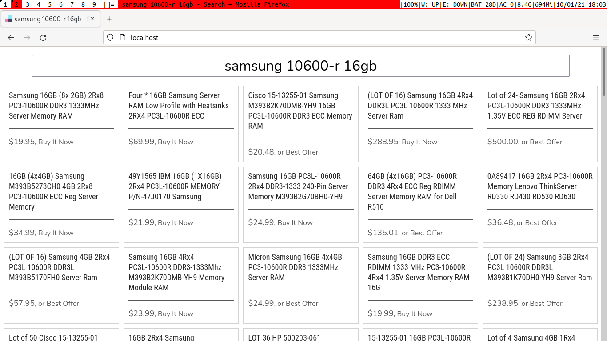
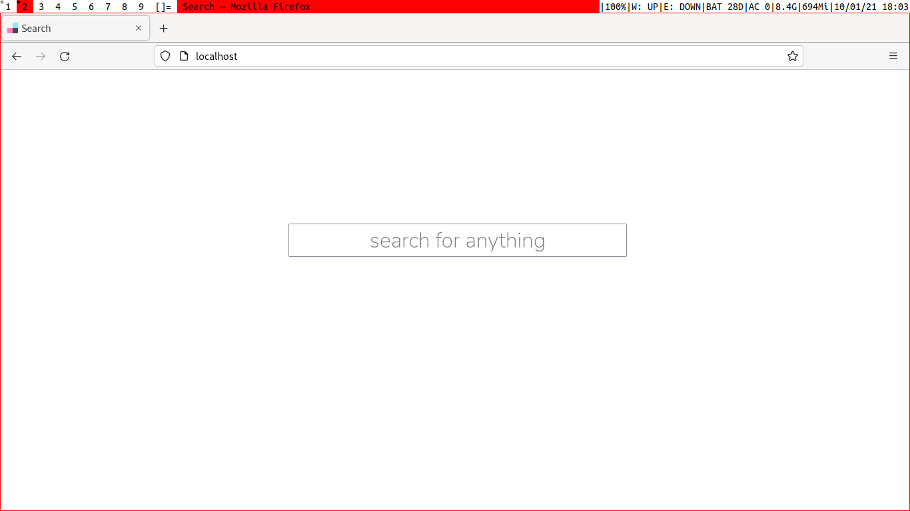

# Getting Started

## Installation

```
git clone https://github.com/haydenheroux/search.git
cd search
pip install -r requirements.txt
```

Alternatively, run `pip` through Python's module argument.

```
python -m pip install -r requirements.txt
```

## Usage

```
flask run
```

Like `pip`, `flask` can be run through Python's module argument.

```
python -m flask run
```

Open `localhost` or `127.0.0.1` in any web browser for the web interface.



### Elevation

Especially on Linux, port 80 is commonly reserved for other applications, resulting in an error when Flask attempts to allocate the port. To fix this error, either:

**Elevate Flask permissions (Linux)**

```
sudo flask run
```

Or, using the module method:

```
sudo python -m flask run
```

**Change Flask port**

In `search/.flaskenv`, change `FLASK_RUN_PORT=80` to `FLASK_RUN_PORT=newport`, where `newport` is an unused port. Changing `newport` Flask's default of `5000` should work for almost all purposes, although any unused port can work. To access the web interface, to navigate to `localhost:newport` or `127.0.0.1:newport` after restarting Flask.

# Features

 - Code-configurable
   - Build-Your-Own parsers in `parsers/`
   - Chain custom operations in `main.py`
   - Modify the interface in `templates/`
 - Web interface
   - Single end-point
   - One-way HTML forms
 - HTTP-only API
   - Built using `requests`
   - Replace with any alternative (including async!)

# Author

© 2021 Hayden Heroux
